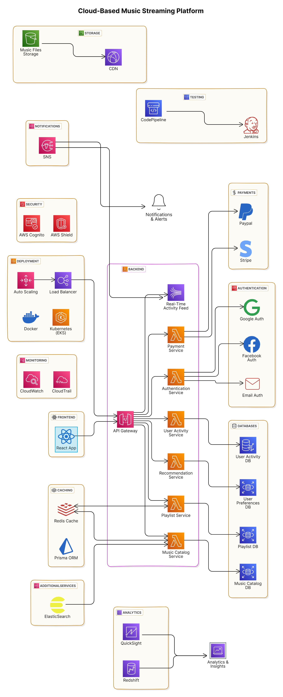

# Cloud-Based Music Streaming Platform

This project is a cloud-based music streaming platform system design, built using modern technologies and cloud services to ensure scalability, performance, and ease of use. The platform integrates **React** on the frontend, **AWS Lambda** for serverless architecture, **AWS RDS/Neptune** for database management, and services like **SNS**, **SQS**, and **CloudWatch** for monitoring and notifications.

---



---


## Table of Contents

- [System Architecture](#system-architecture)
  - [Frontend](#frontend)
  - [Authentication](#authentication)
  - [Backend](#backend)
  - [Databases](#databases)
  - [Caching & Optimization](#caching--optimization)
  - [Deployment & Scalability](#deployment--scalability)
  - [Storage & Content Delivery](#storage--content-delivery)
  - [Payments](#payments)
  - [Monitoring & Logging](#monitoring--logging)
  - [Security](#security)
  - [Analytics & Insights](#analytics--insights)
  - [Notifications & Alerts](#notifications--alerts)
- [Technologies Used](#technologies-used)
- [Deployment](#deployment)
- [Services Flow](#services-flow)
- [System Components](#system-components)

## System Architecture

The architecture of the music streaming platform is based on a **microservices** approach and uses **cloud-native technologies**. Below is the breakdown of the components used.

### Frontend
- **React App**  
  - Built with React for a modern and responsive user interface.

### Authentication
- **AWS Cognito** for secure user authentication and authorization.
- **Google Auth**, **Facebook Auth**, and **Email Auth** for user login options.

### Backend
- **AWS Lambda** for serverless backend services.
- **API Gateway** as the entry point for the backend.
- Various backend services (Music Catalog, User Activity, Playlist, etc.) running on **Lambda**.

### Databases
- **AWS RDS** for storing music catalog, playlists, and user preferences.
- **AWS Neptune** for storing user activity in a graph structure.

### Caching & Optimization
- **Redis** for caching frequently accessed data.
- **Prisma ORM** for efficient database queries.

### Deployment & Scalability
- **AWS EKS** for container orchestration.
- **Docker** for containerization.
- **Auto Scaling** to handle traffic spikes.
- **Load Balancer** for distributing incoming requests.

### Storage & Content Delivery
- **AWS S3** for storing music files.
- **AWS CloudFront** as a CDN for fast and reliable content delivery.

### Payments
- **Stripe** and **PayPal** integration for payment processing.

### Monitoring & Logging
- **AWS CloudWatch** and **CloudTrail** for monitoring application health and performance.

### Security
- **AWS Cognito** for authentication.
- **AWS Shield** for protection against DDoS attacks.

### Analytics & Insights
- **AWS Redshift** for data warehousing.
- **AWS QuickSight** for business intelligence and reporting.

### Notifications & Alerts
- **AWS SNS** for real-time notifications and alerts.

## Technologies Used

- **Frontend**: React.js
- **Backend**: AWS Lambda, AWS API Gateway, AWS S3, AWS CloudFront, AWS SNS, AWS SQS
- **Database**: AWS RDS, AWS Neptune
- **Authentication**: AWS Cognito, Google Auth, Facebook Auth, Email Auth
- **Caching**: Redis
- **ORM**: Prisma
- **Payments**: Stripe, PayPal
- **Monitoring**: AWS CloudWatch, AWS CloudTrail
- **Deployment**: AWS EKS, Docker, Kubernetes, Auto Scaling, Load Balancer
- **Analytics**: AWS Redshift, AWS QuickSight
- **Notifications**: AWS SNS, AWS SQS

## Deployment

1. Use **AWS CloudFormation** or **Terraform** to deploy the infrastructure.
2. Ensure **Docker** containers are created for backend services.
3. Use **AWS EKS** for Kubernetes deployment and scaling.
4. Use **AWS CodePipeline** and **Jenkins** for CI/CD.

## Services Flow

1. User Authentication is handled by **AWS Cognito** through **Google**, **Facebook**, or **Email Auth**.
2. **Frontend** communicates with **API Gateway** to trigger backend services.
3. **Music Catalog**, **User Activity**, and **Playlist services** interact with respective databases via **AWS Lambda**.
4. Payments are processed through **Stripe** and **PayPal**.
5. Real-time notifications are managed using **SNS** and **AWS Kinesis**.
6. Caching is done via **Redis** to optimize repeated requests.
7. **Analytics & Insights** are gathered using **Redshift** and visualized via **QuickSight**.

## System Components

```mermaid
graph TD;
  Frontend[React App]
  API-Gateway[API Gateway]
  Auth-Service[Authentication Service]
  Music-Catalog-Service[Music Catalog Service]
  User-Activity-Service[User Activity Service]
  Payment-Service[Payment Service]
  Playlist-Service[Playlist Service]
  Recommendation-Service[Recommendation Service]
  Real-Time-Activity-Feed[Real-Time Activity Feed]
  Redis[Redis Cache]
  Music-Catalog-DB[Music Catalog DB]
  User-Activity-DB[User Activity DB]
  Playlist-DB[Playlist DB]
  User-Preferences-DB[User Preferences DB]
  Stripe[Stripe]
  Paypal[Paypal]
  CDN[CDN]
  Music-Storage[Music Files Storage]
  ElasticSearch[ElasticSearch]
  Redshift[Redshift]
  QuickSight[QuickSight]
  SNS[SNS]
  Jenkins[Jenkins]
  CodePipeline[CodePipeline]
  
  Frontend --> API-Gateway
  API-Gateway --> Auth-Service
  API-Gateway --> Music-Catalog-Service
  API-Gateway --> User-Activity-Service
  API-Gateway --> Payment-Service
  API-Gateway --> Playlist-Service
  API-Gateway --> Recommendation-Service
  API-Gateway --> Real-Time-Activity-Feed
  Auth-Service --> Google-Auth[Google Auth]
  Auth-Service --> Facebook-Auth[Facebook Auth]
  Auth-Service --> Email-Auth[Email Auth]
  Music-Catalog-Service --> Music-Catalog-DB
  User-Activity-Service --> User-Activity-DB
  Playlist-Service --> Playlist-DB
  Recommendation-Service --> User-Preferences-DB
  Payment-Service --> Stripe
  Payment-Service --> Paypal
  Redis --> Music-Catalog-Service
  Redis --> Playlist-Service
  Music-Storage --> CDN
  ElasticSearch --> Music-Catalog-Service
  Redshift --> QuickSight
  SNS --> Real-Time-Activity-Feed
  Jenkins --> CodePipeline
  SNS --> Notifications-And-Alerts[Notifications & Alerts]
